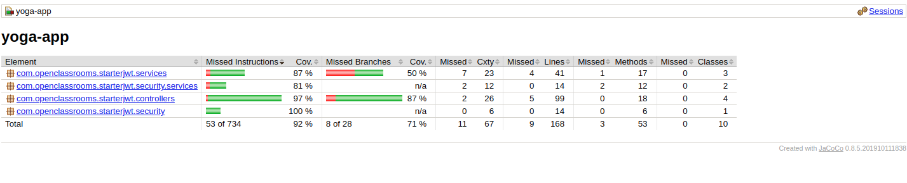
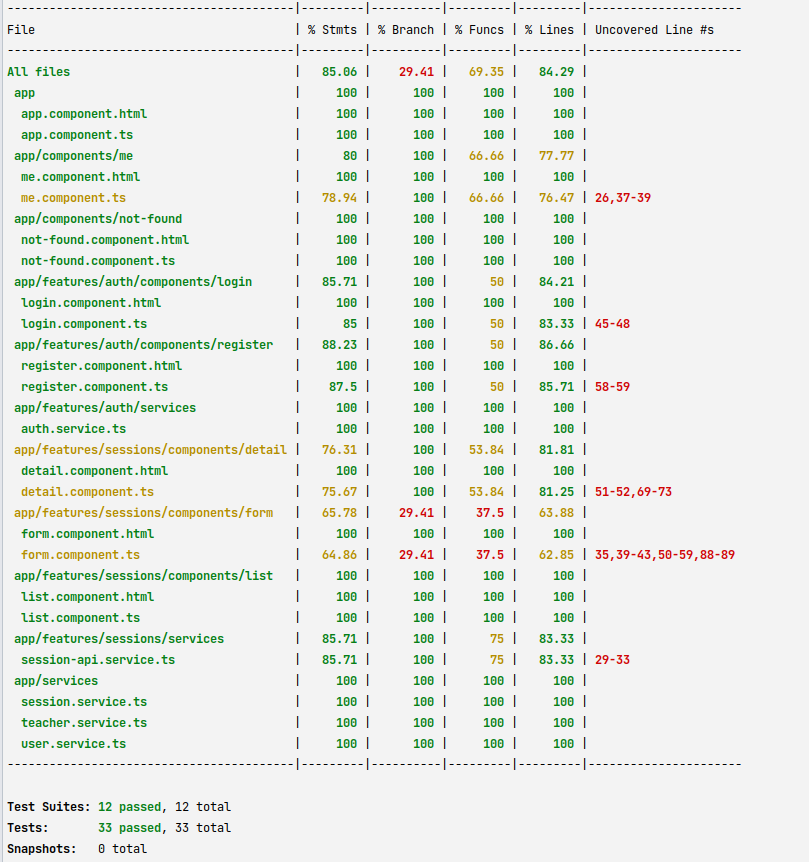
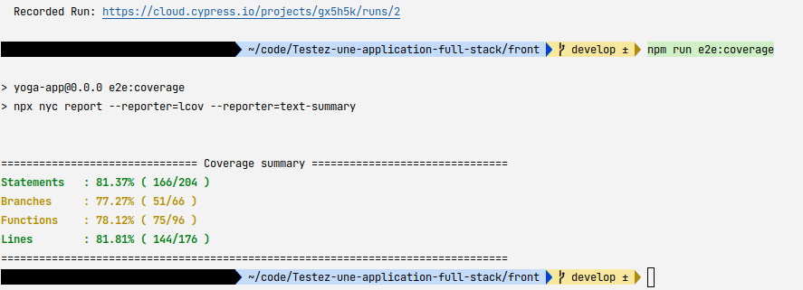

# Yoga Studio Website

## Description

This is a website for a yoga studio. It is a single page application that uses Angular and java Spring Boot. It is a responsive website that uses CSS Grid and Flexbox for layout. It also uses CSS animations and transitions for a more dynamic user experience.

## Technologies Used

* Angular 14.1.0
* Spring Boot 2.7.9

For testing purpose :
  * Front :
    * Jest
    * Cypress
  * Back :
    * JUnit
    * Mockito
    * MySql

## How to run the application with tests

**Full disclosure : this is the configuration I used for my tests. This shall not be used for real usage purpose.
You can change it in the `application.properties` file in the back folder.**

**For production-ready application, your password should be passed as an environment variable, as for both database and all your apps**

### Prerequisites
#### Database
You will need a MySql server running. To simplify your task, you can use the docker-compose.yml file in the back folder. To do so, you will need to install docker and docker-compose.

It is located in `ressources/docker/docker-compose.yml`. You can run it with the following command :

```bash
docker-compose up -d
```
Then with the docker compose up or your own instance of MySqlServer,
you will need to create a database named `test` and a root user named `root` with the password `root`.

Then create and populate the database with the script located in : `ressources/sql/script.sql`

### Back
* Go to the back folder with 
    ```bash
    cd back
    ```
* Do the maven cycle that launch the tests with 
    ```bash
    mvn clean verify
  ```
* Run the application with 
    ```bash
    mvn spring-boot:run
  ```
  
#### Coverage
you will find the report in `target/site/jacoco/index.html`

The current result are the following :


### Front

* Go to the front folder with 
    ```bash
    cd front
    ```
* Install the dependencies with 
    ```bash
    npm install
  ```
  
* Do the tests with 
    ```bash
    npm run test
  ```
  
* Do the e2e tests with :
  * normal mode : 
      ```bash
      npm run e2e
    ```
  * CI mode : 
      ```bash
      npm run e2e:ci
      ```
  
  
* run the application with 
    ```bash
    npm run start
  ```
  
You application will be available at `http://localhost:4200`

#### Coverage

You can get the application unit test coverage thanks to the following command on the front folder :

```bash
npm run test:ci
```

The current result are the following :


Get the e2e test coverage thanks to the following command on the front folder :

```bash
npm run e2e:coverage
```

The current result are the following :


You will find a Cypress cloud report in https://cloud.cypress.io/projects/gx5h5k/runs/2


* Run the application with 
    ```bash
    npm run start
  ```
  
You application will be available at `http://localhost:4200`

#Tips
To stop the docker instance, you can use the following command :

```bash
docker-compose stop
```

or to stop and remove the container :

```bash
docker-compose down
```
