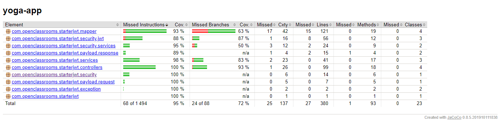
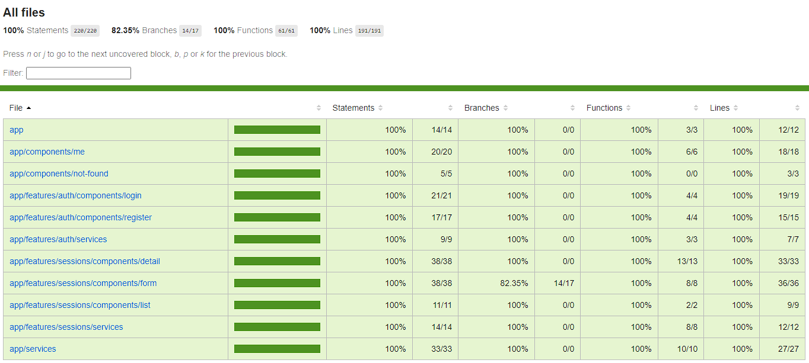
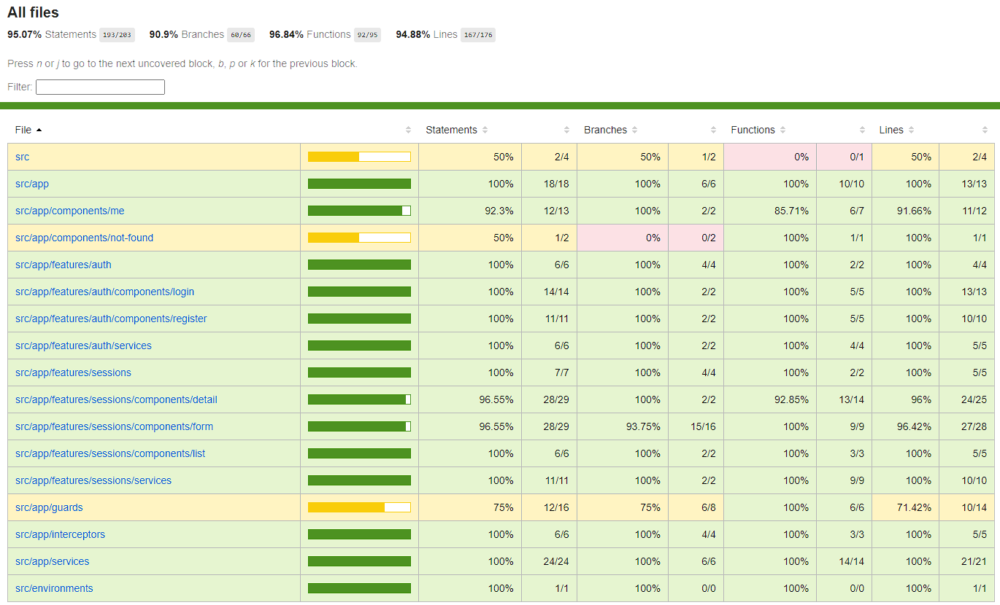

# Yoga App !

    

## Prerequisites

- This project run on **Java 17**, download [here](https://www.oracle.com/fr/java/technologies/downloads/).

- **Maven** is needed to build the project, download [here](https://maven.apache.org/download.cgi).

- The database is manage on **MySQL**, download [here](https://dev.mysql.com/downloads/installer/).

## Getting Started

### 1. Clone the github repository

> git clone https://github.com/VelosoTony/Testez-une-application-full-stack.git

### 2. Create MySQL Database

Start MySQL, connect to MySQL Command Line or GUI tool.

Run the script below to create the **yoga** database.

> ressources\sql\create_DB_Yoga.sql

## Back-End

### Set the credential of database access of API

> /src/main/resources/application.properties

modify `spring.datasource.username` and `spring.datasource.password` with MySQL user/password.

### Start the API using maven

> mvn spring-boot:run

_/!\ To run this command you need to be in the directory "\back" containing the file "pom.xml"._

### **Run back-end test**

For launch and generate the jacoco code coverage:

> mvn clean test

Jacoco report is available here :

> back\target\site\jacoco\index.html

## Front-End

_/!\ To run the command for front-end, go to the directory "\back"_

### Install dependencies:

> npm install

### Launch Front-end

> npm run start

Open your browser on `http://localhost:4200/`

By default the admin account is:

- login: yoga@studio.com
- password: test!1234

### **Unitary test**

Launching test :

> npm run test

Jest report is available here :

> front\coverage\jest\lcov-report\index.html

#### **E2E test**

Launching e2e test:

> npm run e2e:ci

Generate coverage report (you should launch e2e test before):

> npm run e2e:coverage

Cypress report is available here :

> front\coverage\lcov-report\index.html

